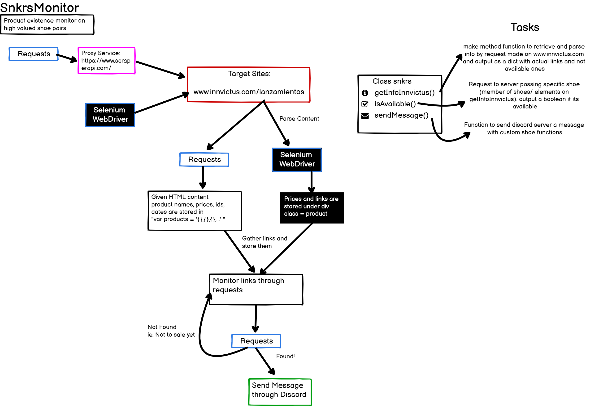

# SnkrsMonitor

This project scrappe information from www.innvictus.com site to know when a shoe is available monitoring it constantly.

It is build using https://github.com/bigspotteddog/landing-page-service scheme and advice on how to organize a project, Using a one-pager, workflow diagram and task-list.

## One-pager

### One pager (Explicación de una página)
Este proyecto es un monitor de productos de tiendas de tenis (sneakers) que tienen un alto valor en el mercado.

Estos tenis son dificil de obtener debido a lo limitado de las piezas, su precio puede subir más de 50% una vez adquiridos. Se pueden adquirir a traves de páginas en linea como www.innvictus.com, pero existe competencia y saber cuando están disponibles para compra es importante.

El tiempo para comprar es límitado, por lo que se necesita conocer con márgenes pequeños de minutos o segundos cuando están disponibles. El propósito de este código es avisar cuando estén disponibles para la compra.

Esto se logra identificando los tenis que se tiene intención de compra y realizar peticiones (requests) al servidor, para saber si ya se encuentran disponibles para la compra, seguido de esto se emitirá una alerta por medios como Discord o Gmail.

Las peticiones que se realizan al servidor deben pasar por un servicio de proxies que manejen los datos, para evitar que este los bloquee; el servicio no es gratuito siendo estos los proveedores: https://www.scraperapi.com/, https://scrapingant.com/ El primero siendo el más barato con 1000 peticiones al mes gratis y 250,000 pagando $29 USD o $577 MXN al 14/02/2021.

## Workflow

## Task list

### Class snkrs
#### getInfoInnvictus
* Task 1: Make requests on new/launching
* Task 2: Parse "var products" content
* Task 3: Content to dict with url available on not available

#### isAvailable
* Task 1: Gather url on shoe
* Task 2: Request page server 
* Task 3: Determine if available then return boolean

#### sendMessage
* Task 1: Figure out how to connect python and discord (Webhooks?)
* Task 2: Send message given dict shoe elements with custom str